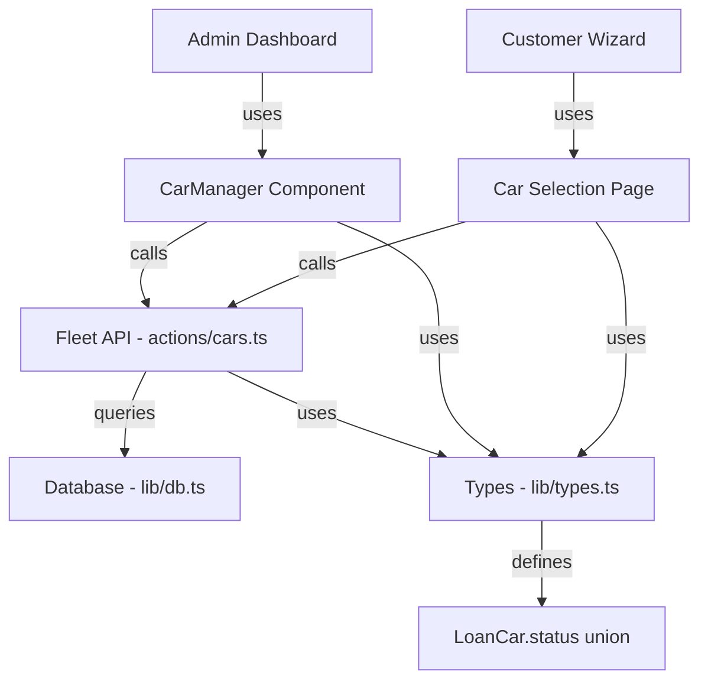
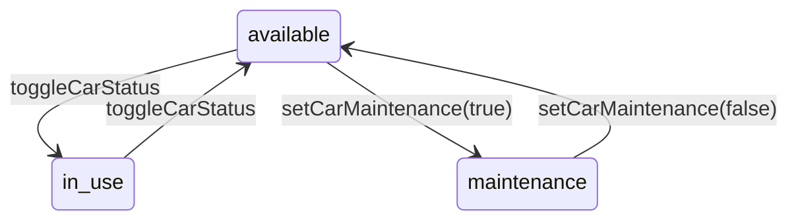

# Design Document: Car Maintenance Status

## Overview

This feature extends the existing loan car status system from a binary (`available` | `in_use`) to a ternary model (`available` | `in_use` | `maintenance`). The change touches the type system, database layer, server actions, admin UI component, and customer-facing car selection page. The approach is minimal: widen the status union type, update the toggle logic to support a three-state transition, and ensure the existing `getAvailableCars` query naturally excludes maintenance cars.

## Architecture

The existing architecture remains unchanged. The feature modifies existing layers rather than introducing new components:



Changes flow through these layers:
1. `lib/types.ts` — Add `"maintenance"` to the `LoanCar.status` union
2. `lib/db.ts` — No changes needed (status is already stored as a string; `getCarsByStatus("available")` already excludes non-available cars)
3. `actions/cars.ts` — Update `toggleCarStatus` to handle three-state transitions, add a dedicated `setCarMaintenance` action
4. `components/CarManager.tsx` — Update UI to show maintenance status badge and contextual action buttons
5. `app/wizard/car-selection/page.tsx` — No changes needed (already calls `getAvailableCars` which filters by `status = 'available'`)

## Components and Interfaces

### Type Changes (`lib/types.ts`)

```typescript
export interface LoanCar {
  id: number;
  make: string;
  model: string;
  colour: string | null;
  plateNumber: string | null;
  status: "available" | "in_use" | "maintenance";
}
```

### Server Action Changes (`actions/cars.ts`)

New action for setting maintenance status:

```typescript
export async function setCarMaintenance(carId: number, maintenance: boolean): Promise<LoanCar>
```

- When `maintenance` is `true`: sets status from `available` → `maintenance`
- When `maintenance` is `false`: sets status from `maintenance` → `available`
- Throws if the car is `in_use` and `maintenance` is `true` (cannot put an in-use car into maintenance)
- Uses a database transaction with `SELECT ... FOR UPDATE` for consistency

The existing `toggleCarStatus` continues to toggle between `available` and `in_use` only. It throws if the car is in `maintenance` status, since a maintenance car should not be toggled to in-use directly.

### CarManager UI Changes (`components/CarManager.tsx`)

Status display mapping:
- `available` → green "Available" badge (existing)
- `in_use` → amber "In Use" badge (existing)  
- `maintenance` → red/orange "Maintenance" badge (new)

Action buttons per status:
| Current Status | Available Actions |
|---|---|
| `available` | "Set In Use", "Set Maintenance", Edit, Delete |
| `in_use` | "Set Available", Edit, Delete |
| `maintenance` | "Set Available", Edit, Delete |

## Data Models

No schema migration is required. The `loan_cars.status` column is a text/varchar column. The application enforces valid values through the TypeScript type system. The new `"maintenance"` value is simply a new string stored in the existing column.

### Status Transition Rules



Invalid transitions:
- `in_use` → `maintenance` (car must be returned first)
- `maintenance` → `in_use` (car must be set available first)


## Correctness Properties

*A property is a characteristic or behavior that should hold true across all valid executions of a system — essentially, a formal statement about what the system should do. Properties serve as the bridge between human-readable specifications and machine-verifiable correctness guarantees.*

### Property 1: Status-dependent action buttons

*For any* LoanCar rendered in the CarManager, the set of displayed action buttons must match the car's current status: "available" cars show "Set In Use" and "Set Maintenance"; "in_use" cars show "Set Available" only (no maintenance option); "maintenance" cars show "Set Available" only.

**Validates: Requirements 2.1, 2.3, 2.5**

### Property 2: Maintenance toggle round-trip

*For any* LoanCar with status "available", setting it to maintenance and then back to available should produce a car with status "available" — the original status is restored.

**Validates: Requirements 2.2, 2.4**

### Property 3: Available cars filtering excludes non-available statuses

*For any* set of LoanCars with mixed statuses ("available", "in_use", "maintenance"), calling `getAvailableCars` should return only cars whose status is "available". No car with status "maintenance" or "in_use" should appear in the result.

**Validates: Requirements 3.1, 3.2**

### Property 4: Maintenance status persistence

*For any* LoanCar set to "maintenance" via `setCarMaintenance`, subsequently querying that car from the database should return a status of "maintenance".

**Validates: Requirements 4.1**

### Property 5: Failed update preserves original status

*For any* LoanCar and any database error during a status update, the car's status in the database should remain equal to its status before the attempted update.

**Validates: Requirements 4.3**

## Error Handling

| Scenario | Behavior |
|---|---|
| `setCarMaintenance(id, true)` on an `in_use` car | Throw error: "Cannot set an in-use car to maintenance. Return the car first." |
| `setCarMaintenance(id, true)` on an already `maintenance` car | No-op or return current state (idempotent) |
| `setCarMaintenance(id, false)` on a non-maintenance car | Throw error: "Car is not in maintenance status." |
| `toggleCarStatus` on a `maintenance` car | Throw error: "Cannot toggle a car in maintenance. Set it to available first." |
| Car not found by ID | Throw error: "Car with id {id} not found" (existing behavior) |
| Database transaction failure | Rollback transaction, throw error, status unchanged |

## Testing Strategy

### Property-Based Testing

Use `fast-check` (already installed in the project) with Vitest. Each property test runs a minimum of 100 iterations.

- **Property 1** (Status-dependent action buttons): Generate random LoanCar objects with each of the three statuses. Render CarManager and assert correct buttons are present/absent.
  - Tag: **Feature: car-maintenance-status, Property 1: Status-dependent action buttons**

- **Property 2** (Maintenance toggle round-trip): Generate random available LoanCar objects. Apply setCarMaintenance(true) then setCarMaintenance(false) and verify status returns to "available".
  - Tag: **Feature: car-maintenance-status, Property 2: Maintenance toggle round-trip**

- **Property 3** (Available cars filtering): Generate random arrays of LoanCar objects with mixed statuses. Filter using the same logic as getAvailableCars and verify only "available" cars are returned.
  - Tag: **Feature: car-maintenance-status, Property 3: Available cars filtering excludes non-available statuses**

- **Property 4** (Maintenance status persistence): Generate random car data, create car, set to maintenance, query back and verify status.
  - Tag: **Feature: car-maintenance-status, Property 4: Maintenance status persistence**

- **Property 5** (Failed update preserves status): Generate random cars, simulate DB failure during update, verify status unchanged.
  - Tag: **Feature: car-maintenance-status, Property 5: Failed update preserves original status**

### Unit Testing

Unit tests complement property tests for specific examples and edge cases:

- Verify maintenance badge renders with correct CSS class
- Verify "no cars available" message when all cars are in maintenance/in_use (edge case from 3.3)
- Verify error thrown when attempting to set in_use car to maintenance
- Verify error thrown when toggling a maintenance car
- Verify idempotent behavior of setting an already-maintenance car to maintenance
