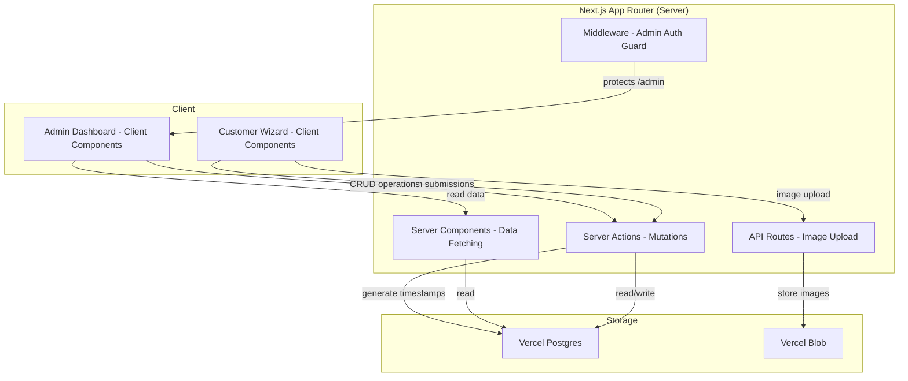

# Design Document: FlexTyres Self-Service Loan Car System

## Overview

The FlexTyres Loan Car System is a Next.js (App Router) web application with two main surfaces: a customer-facing multi-step Wizard for self-service pick-up and drop-off, and a protected Admin Dashboard for staff management. The system uses Vercel Postgres for relational data (logs, car status) and Vercel Blob for license photo storage. All timestamps are generated server-side to ensure accuracy for toll and fine disputes.

The architecture follows a standard Next.js App Router pattern with Server Actions for mutations, Server Components for data fetching, and Client Components for interactive UI. No external auth provider is needed for customers (phone-based identification); admin auth uses a simple credential-based approach with middleware protection.

## Architecture



### Key Architectural Decisions

1. **Server Actions for mutations**: All state-changing operations (create log, toggle car status, etc.) go through Server Actions. This ensures Server_Side_Timestamps are generated on the server, not the client.
2. **API Route for image upload**: License photo uploads use a dedicated API route (`/api/upload`) because Server Actions have payload size limits that conflict with image uploads.
3. **Middleware for admin auth**: Next.js middleware checks for a valid session cookie on all `/admin/*` routes, redirecting unauthenticated users to `/admin/login`.
4. **No customer auth**: Customers are identified solely by phone number. No session or login is required for the wizard flow.
5. **Internationalization via dictionary files**: KO/EN translations stored as JSON dictionaries, loaded based on user selection. No i18n routing — language is client-side state.

## Components and Interfaces

### Customer Wizard Components

```
app/
├── page.tsx                          # Landing: language + action selection (Step 0)
├── wizard/
│   ├── layout.tsx                    # Wizard layout with step indicator
│   ├── identity/page.tsx             # Step 1: Name, Phone, Plate
│   ├── license/page.tsx              # Step 2: License photo upload
│   ├── car-selection/page.tsx        # Step 3: Available car grid
│   ├── terms/page.tsx                # Step 4: Terms agreement
│   └── confirmation/page.tsx         # Step 5: Success screen
├── admin/
│   ├── login/page.tsx                # Admin login form
│   ├── layout.tsx                    # Admin layout with nav
│   └── page.tsx                      # Dashboard: log table, car management
├── api/
│   └── upload/route.ts               # License photo upload endpoint
├── actions/
│   ├── session.ts                    # Create/complete session actions
│   ├── cars.ts                       # Car status actions
│   ├── logs.ts                       # Log CRUD actions
│   └── admin-auth.ts                 # Admin login/logout actions
├── lib/
│   ├── db.ts                         # Vercel Postgres client + queries
│   ├── blob.ts                       # Vercel Blob upload helper
│   ├── validation.ts                 # Input validation (phone, fields)
│   └── dictionaries/
│       ├── en.json                   # English translations
│       └── ko.json                   # Korean translations
├── components/
│   ├── StepIndicator.tsx             # Visual step progress bar
│   ├── BigButton.tsx                 # Large, high-contrast button
│   ├── CarCard.tsx                   # Loan car display card
│   ├── LicenseUploader.tsx           # Camera/gallery upload component
│   ├── LogTable.tsx                  # Admin log table
│   └── CarManager.tsx                # Admin car status toggles
└── middleware.ts                      # Admin route protection
```

### Key Interfaces

```typescript
// Session context passed through wizard steps (client-side state)
interface WizardSession {
  language: "ko" | "en";
  action: "pickup" | "dropoff";
  customerName: string;
  phoneNumber: string;
  customerPlateNumber: string;
  licensePhotoUrl: string | null;
  selectedCarId: number | null;
  termsAccepted: {
    etoll: boolean;
    fines: boolean;
    accident: boolean;
  };
}

// Server Action: complete a pick-up session
async function completePickup(data: {
  customerName: string;
  phoneNumber: string;
  customerPlateNumber: string;
  licensePhotoUrl: string;
  loanCarId: number;
}): Promise<{ success: boolean; error?: string }>

// Server Action: complete a drop-off session
async function completeDropoff(data: {
  customerName: string;
  phoneNumber: string;
  loanCarId: number;
}): Promise<{ success: boolean; error?: string }>

// Server Action: admin log operations
async function updateLogEntry(logId: number, data: Partial<LogEntry>): Promise<void>
async function deleteLogEntry(logId: number): Promise<void>
async function createManualLogEntry(data: ManualLogInput): Promise<void>

// Server Action: admin car operations
async function toggleCarStatus(carId: number): Promise<void>
```

## Data Models

### Database Schema (Vercel Postgres)

```sql
CREATE TABLE loan_cars (
  id SERIAL PRIMARY KEY,
  make VARCHAR(50) NOT NULL,
  model VARCHAR(50) NOT NULL,
  colour VARCHAR(30),
  plate_number VARCHAR(20) UNIQUE,
  status VARCHAR(20) NOT NULL DEFAULT 'available'
    CHECK (status IN ('available', 'in_use'))
);

CREATE TABLE logs (
  id SERIAL PRIMARY KEY,
  created_at TIMESTAMPTZ NOT NULL DEFAULT NOW(),
  action VARCHAR(10) NOT NULL CHECK (action IN ('pickup', 'dropoff')),
  customer_name VARCHAR(100) NOT NULL,
  phone_number VARCHAR(20) NOT NULL,
  customer_plate_number VARCHAR(20),
  loan_car_id INTEGER NOT NULL REFERENCES loan_cars(id),
  license_photo_url TEXT,
  is_manual BOOLEAN NOT NULL DEFAULT FALSE
);

CREATE INDEX idx_logs_created_at ON logs(created_at DESC);
CREATE INDEX idx_logs_phone ON logs(phone_number);
CREATE INDEX idx_loan_cars_status ON loan_cars(status);
```

### TypeScript Types

```typescript
interface LoanCar {
  id: number;
  make: string;
  model: string;
  colour: string | null;
  plateNumber: string | null;
  status: "available" | "in_use";
}

interface LogEntry {
  id: number;
  createdAt: Date;           // Server_Side_Timestamp
  action: "pickup" | "dropoff";
  customerName: string;
  phoneNumber: string;
  customerPlateNumber: string | null;
  loanCarId: number;
  licensePhotoUrl: string | null;
  isManual: boolean;
}

// For admin manual entry creation
interface ManualLogInput {
  action: "pickup" | "dropoff";
  customerName: string;
  phoneNumber: string;
  customerPlateNumber?: string;
  loanCarId: number;
  licensePhotoUrl?: string;
}

// Validation result
interface ValidationResult {
  valid: boolean;
  errors: Record<string, string>;
}
```

### Seed Data

```typescript
const FLEET: Omit<LoanCar, "id">[] = [
  { make: "Toyota", model: "Camry", colour: "White", plateNumber: "DO04AB", status: "available" },
  { make: "Toyota", model: "Camry", colour: "Grey", plateNumber: "DL93GR", status: "available" },
  { make: "Toyota", model: "Corolla", colour: null, plateNumber: "DH34UJ", status: "available" },
  { make: "Kia", model: "Rio", colour: null, plateNumber: "BW13WQ", status: "available" },
  { make: "Suzuki", model: "Swift", colour: null, plateNumber: "BK06RH", status: "available" },
  { make: "Honda", model: "Jazz", colour: null, plateNumber: null, status: "available" },
  { make: "Holden", model: "Commodore", colour: null, plateNumber: "BF35WY", status: "available" },
  { make: "Toyota", model: "Hiace", colour: null, plateNumber: null, status: "available" },
];
```


## Correctness Properties

*A property is a characteristic or behavior that should hold true across all valid executions of a system — essentially, a formal statement about what the system should do. Properties serve as the bridge between human-readable specifications and machine-verifiable correctness guarantees.*

### Property 1: Language dictionary consistency

*For any* wizard screen and any language selection (KO or EN), all displayed text strings on that screen should exist in and match the corresponding language dictionary.

**Validates: Requirements 1.2**

### Property 2: Identity form rejects incomplete submissions

*For any* combination of Customer Name, Phone Number, and Plate Number fields where at least one field is empty or whitespace-only, the validation function should return invalid and the form should prevent progression.

**Validates: Requirements 2.2**

### Property 3: Phone number validation

*For any* string that does not match a valid Australian phone number format (04XX XXX XXX, +614XX XXX XXX, or equivalent digit patterns), the phone validation function should reject it. *For any* string that does match, it should accept it.

**Validates: Requirements 2.3**

### Property 4: File upload validation

*For any* file metadata, the upload validator should accept the file if and only if the MIME type is `image/jpeg` or `image/png` and the file size is at most 10 MB. All other files should be rejected.

**Validates: Requirements 3.5**

### Property 5: Car grid shows exactly available cars

*For any* set of loan cars with mixed statuses, the car selection grid should display exactly those cars whose status is "available" — no more, no fewer.

**Validates: Requirements 4.1, 4.3**

### Property 6: Car card displays all required fields

*For any* loan car, the rendered car card should contain the car's make, model, and plate number. If the car has a colour, the card should also display the colour.

**Validates: Requirements 4.2**

### Property 7: Terms proceed button enabled iff all agreed

*For any* combination of the three term agreement booleans (etoll, fines, accident), the proceed button should be enabled if and only if all three are true.

**Validates: Requirements 5.2, 5.3**

### Property 8: Pickup transaction integrity

*For any* valid pickup submission (valid customer data, valid available car), completing the pickup should: (a) create a log entry with action "pickup", (b) set the selected car's status to "in_use", and (c) the log entry should have a server-generated timestamp.

**Validates: Requirements 6.1**

### Property 9: Dropoff transaction integrity

*For any* valid dropoff submission (valid customer data, valid in-use car), completing the dropoff should: (a) create a log entry with action "dropoff", (b) set the returned car's status to "available", and (c) the log entry should have a server-generated timestamp.

**Validates: Requirements 6.2, 7.2**

### Property 10: Drop-off flow shows only in-use cars

*For any* set of loan cars with mixed statuses, the drop-off car selection should display exactly those cars whose status is "in_use".

**Validates: Requirements 7.1**

### Property 11: Log table displays all required fields

*For any* log entry, the rendered table row should contain the timestamp, action type, customer name, phone number, and loan car plate number.

**Validates: Requirements 9.1**

### Property 12: Log entries sorted descending by timestamp

*For any* list of log entries returned by the query function, each entry's timestamp should be greater than or equal to the next entry's timestamp (descending order).

**Validates: Requirements 9.3**

### Property 13: Log edit persistence

*For any* existing log entry and any valid partial update, after applying the edit, reading the log entry back should reflect the updated fields while preserving unchanged fields.

**Validates: Requirements 10.1**

### Property 14: Log deletion removes record

*For any* existing log entry, after deletion, querying for that log entry by ID should return no result, and the total log count should decrease by one.

**Validates: Requirements 10.2**

### Property 15: Car status toggle is involutory

*For any* loan car, toggling its status should flip it from "available" to "in_use" or vice versa. Toggling twice should return the car to its original status.

**Validates: Requirements 10.3**

### Property 16: Manual log entry creation

*For any* valid manual log input provided by an admin, creating a manual entry should produce a log entry with all supplied fields, `is_manual` set to true, and a server-generated timestamp.

**Validates: Requirements 10.4**

### Property 17: Pickup log deletion frees car

*For any* log entry with action "pickup", deleting that entry should set the corresponding loan car's status to "available".

**Validates: Requirements 10.5**

### Property 18: Step indicator accuracy

*For any* wizard step at index N in a flow with T total steps, the step indicator component should render showing step N of T.

**Validates: Requirements 12.3**

### Property 19: Navigation button presence by step position

*For any* wizard step at index N in a flow with T total steps: if N > 1, a "Back" button should be present; if N < T, a "Next" button should be present. The first step should have no "Back" button and the last step should have no "Next" button.

**Validates: Requirements 12.4**

## Error Handling

### Client-Side Errors

| Error Scenario | Handling Strategy |
|---|---|
| Empty or invalid form fields | Inline validation errors displayed next to the field. Form submission blocked. |
| Invalid phone number format | Specific error message showing expected Australian format. |
| Invalid file type or size for license upload | Error message indicating accepted formats (JPEG/PNG) and max size (10 MB). |
| Camera access denied by browser | Fallback message suggesting "Upload Image" option instead. |
| License photo upload network failure | Error toast with retry button. Previously entered wizard data preserved in client state. |
| No available cars | Informational message on car selection step. Progression blocked. |

### Server-Side Errors

| Error Scenario | Handling Strategy |
|---|---|
| Database connection failure | Return 500 with generic error message. Log detailed error server-side. |
| Blob storage upload failure | Return error from API route. Client shows retry option. |
| Race condition: car selected but taken by another user | Server Action checks car status before completing pickup. If car is no longer available, return error prompting re-selection. |
| Admin auth token expired | Middleware redirects to login page. |
| Invalid admin credentials | Display "Invalid credentials" message on login form. |
| Concurrent admin edits | Last-write-wins with optimistic UI. Admin dashboard refreshes data after mutations. |

### Data Integrity

- All mutations (pickup, dropoff, status toggle, log CRUD) are performed in database transactions to ensure atomicity.
- Car status changes and log entry creation happen in the same transaction to prevent inconsistent state.
- Server-side timestamps (`DEFAULT NOW()`) ensure clock accuracy regardless of client.

## Testing Strategy

### Testing Framework

- **Unit & Integration Tests**: Vitest (fast, native ESM support, works well with Next.js)
- **Property-Based Tests**: fast-check (JavaScript/TypeScript PBT library, integrates with Vitest)
- **Component Tests**: React Testing Library with Vitest

### Property-Based Tests

Each correctness property from the design document is implemented as a single property-based test using fast-check. Each test runs a minimum of 100 iterations.

Each test is tagged with a comment in the format:
```
// Feature: flextyres-loan-car-system, Property N: <property title>
```

Property tests focus on:
- Validation logic (Properties 2, 3, 4)
- Data filtering and display logic (Properties 5, 6, 7, 10, 11)
- Transaction integrity (Properties 8, 9, 13, 14, 15, 16, 17)
- UI component logic (Properties 1, 18, 19)
- Sort ordering (Property 12)

### Unit Tests

Unit tests complement property tests by covering:
- Specific examples (seed data correctness, specific valid/invalid phone numbers)
- Edge cases (empty car fleet, upload failure retry, no available cars)
- Integration points (Server Action → database, API route → blob storage)
- Admin auth flow (login, redirect, session validation)

### Test Organization

```
__tests__/
├── lib/
│   ├── validation.test.ts          # Properties 2, 3, 4
│   └── validation.property.test.ts # PBT for validation
├── actions/
│   ├── session.test.ts             # Properties 8, 9
│   ├── cars.test.ts                # Properties 5, 10, 15
│   └── logs.test.ts                # Properties 12, 13, 14, 16, 17
├── components/
│   ├── CarCard.test.tsx            # Property 6
│   ├── StepIndicator.test.tsx      # Property 18
│   ├── TermsAgreement.test.tsx     # Property 7
│   └── WizardNav.test.tsx          # Property 19
└── admin/
    └── LogTable.test.tsx           # Property 11
```
